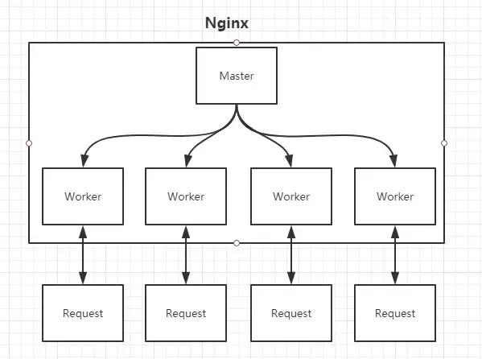
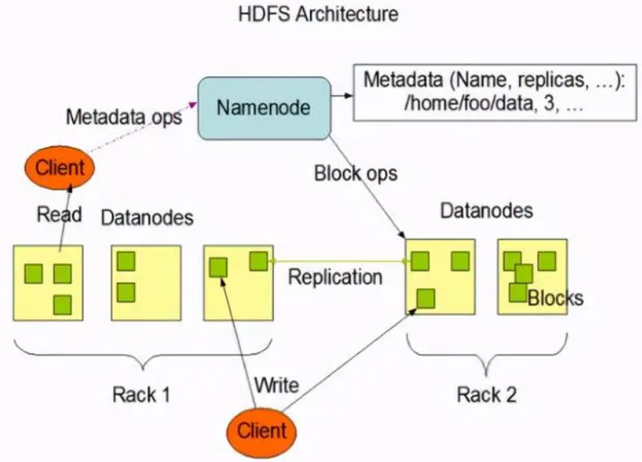
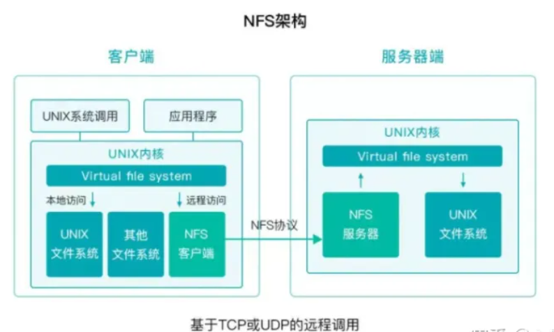

# Algorithmic trading and quant strategies

They are two closely related concepts in the field of financial trading.

- Algorithmic trading is the use of computer algorithms to execute trades automatically. These algorithms are typically based on mathematical models and historical data, and they can be used to trade a wide variety of financial instruments, including stocks, bonds, currencies, and derivatives.
- Quant strategies are trading strategies that are based on quantitative analysis. This type of analysis uses mathematical and statistical methods to identify trading opportunities. Quant strategies can be used in both algorithmic trading and manual trading.

The main difference between algorithmic trading and quant strategies is that algorithmic trading is the actual execution of trades, while quant strategies are the underlying principles that guide those trades.

Quants, or quantitative analysts, are the people who develop quant strategies. They use their knowledge of mathematics, statistics, and computer science to create algorithms that can identify and exploit trading opportunities.

Quant strategies can be very complex, and they often require a significant amount of data and computing power to be effective. However, they can also be very profitable, and they have become increasingly popular in recent years.

Here are some of the benefits of algorithmic trading and quant strategies:

- They can help to reduce risk by automating the trading process and removing human emotion from the equation.
- They can improve efficiency by allowing traders to execute trades more quickly and accurately.
- They can help to identify and exploit trading opportunities that would not be possible to find using traditional methods.

However, there are also some risks associated with algorithmic trading and quant strategies:

- They can be complex and difficult to understand.
- They can be expensive to implement and maintain.
- They can be vulnerable to hacking and other cyberattacks.

Overall, algorithmic trading and quant strategies can be a powerful tool for traders who are looking to improve their performance. However, it is important to understand the risks involved before using these techniques.

Here are some examples of quant strategies:

- Mean reversion is a strategy that trades on the assumption that prices will eventually revert to their mean value.
- Momentum is a strategy that trades on the assumption that prices that are moving in a particular direction will continue to move in that direction.
- Pairs trading is a strategy that trades on the assumption that the prices of two closely correlated assets will converge over time.

These are just a few examples of the many quant strategies that are used by traders today. As the field of quantitative finance continues to evolve, we can expect to see even more sophisticated quant strategies being developed in the future.

# [IbPy](https://interactivebrokers.github.io/tws-api/introduction.html)
To carry out trading with the Interactive Brokers API.
Interactive Brokers LLC is an American multinational brokerage firm. It operates the largest electronic trading platform in the United States by number of daily average revenue trades.

# [statsmodels](https://www.statsmodels.org/stable/index.html)
statsmodels is a Python module that provides classes and functions for the estimation of many different statistical models, as well as for conducting statistical tests, and statistical data exploration. 

# [database](https://www.mysql.com/)
结构化查询语言（Structured Query Language）简称SQL，是一种特殊目的的编程语言，是一种数据库查询和程序设计语言，用于存取数据以及查询、更新和管理关系数据库系统.

结构化查询语言包含6个部分：
1. 数据查询语言（**DQL**: Data Query Language）：其语句，也称为“数据检索语句”，用以从表中获得数据，确定数据怎样在应用程序给出。保留字SELECT是DQL（也是所有SQL）用得最多的动词，其他DQL常用的保留字有WHERE，ORDER BY，GROUP BY和HAVING。这些DQL保留字常与其它类型的SQL语句一起使用。
2. 数据操作语言（**DML**：Data Manipulation Language）：其语句包括动词INSERT、UPDATE和DELETE。它们分别用于添加、修改和删除。
3. 事务控制语言（**TCL**）：它的语句能确保被DML语句影响的表的所有行及时得以更新。包括COMMIT（提交）命令、SAVEPOINT（保存点）命令、ROLLBACK（回滚）命令。
4. 数据控制语言（**DCL**）：它的语句通过GRANT或REVOKE实现权限控制，确定单个用户和用户组对数据库对象的访问。某些RDBMS可用GRANT或REVOKE控制对表单个列的访问。
5. 数据定义语言（**DDL**）：其语句包括动词CREATE,ALTER和DROP。在数据库中创建新表或修改、删除表（CREATE TABLE 或 DROP TABLE）；为表加入索引等。
6. 指针控制语言（**CCL**）：它的语句，像DECLARE CURSOR，FETCH INTO和UPDATE WHERE CURRENT用于对一个或多个表单独行的操作。

根据数据的组织结构不同，主要分为网状数据库、层次数据库、关系型数据库、非关系型数据库。目前常用的是关系型数据库和非关系型数据库。
- 关系型数据库：Oracle、MySQL、SQL Server
   - 易于维护：都是使用表结构，格式一致；
   - 使用方便：SQL语言通用，可用于复杂查询；
   - 复杂操作：支持SQL，可用于一个表以及多个表之间非常复杂的查询。
   - 读写性能比较差，尤其是**海量数据的高效率读写**；
   - 固定的表结构，灵活度稍欠；
   - 高并发读写需求，传统关系型数据库来说，**硬盘I/O是一个很大的瓶颈**。

- 非关系型数据库：MongoDB、Redis，非关系型数据库严格上不是一种数据库，应该是一种数据结构化存储方法的集合，可以是文档或者键值对等。
    - 格式灵活：存储数据的格式可以是文档型、key-value型、列式数据库、图形数据库，使用灵活，应用场景广泛，而关系型数据库则只支持基础类型。
    - 速度快：nosql**可以使用硬盘或者随机存储器作为载体，而关系型数据库只能使用硬盘**；
    - 高扩展性；
    - 成本低：nosql数据库部署简单，基本都是开源软件。
    - 不提供sql支持，学习和使用成本较高；
    - 无事务处理；
    - 数据结构相对复杂，复杂查询方面稍欠。


# [Apache Kafka](https://kafka.apache.org/) 
主要完成消息队列的缓存与分发

Kafka是由Apache软件基金会开发的一个开源流处理平台，由Scala和Java编写。Kafka是一种高吞吐量的分布式发布订阅消息系统，它可以处理消费者在网站中的所有动作流数据。 这种动作（网页浏览，搜索和其他用户的行动）是在现代网络上的许多社会功能的一个关键因素。 这些数据通常是由于吞吐量的要求而通过处理日志和日志聚合来解决。 对于像Hadoop一样的日志数据和离线分析系统，但又要求实时处理的限制，这是一个可行的解决方案。Kafka的目的是通过Hadoop的并行加载机制来统一线上和离线的消息处理，也是为了通过集群来提供实时的消息。

消息系统传递模式：
- 点对点
- 发布-订阅模式

kafka是个中间商，我们为什么不能去掉这个中间商呢，凭着我们的想象也会觉得去掉这些消息引擎系统会更好吧，那我们来谈谈消息引擎系统存在的意义：原因就是**削峰填谷**
- 所谓的“削峰填谷”就是指缓冲上下游瞬时突发流量，使其更平滑。
- 特别是对于那种发送能力很强的上游系统，如果没有消息引擎的保护，“脆弱”的下游系统可能会直接被压垮导致全链路服务“雪崩”。
- 但是，一旦有了消息引擎，它能够有效地对抗上游的流量冲击，真正做到将上游的“峰”填满到“谷”中，避免了流量的震荡。
- 消息引擎系统的另一大好处在于发送方和接收方的松耦合，这也在一定程度上简化了应用的开发，减少了系统间不必要的交互。

> 我们想象一下在双11期间我们购物的情景来形象的理解一下削峰填谷，感受一下Kafka在这中间是怎么去“抗”峰值流量的吧：
> 当我们点击某个商品以后进入付费页面，可是这个简单的流程中就可能包含多个子服务，比如点击购买按钮会调用订单系统生成对应的订单，而处理该订单会依次调用下游的多个子系统服务 ，比如调用支付宝和微信支付的接口、查询你的登录信息、验证商品信息等。显然上游的订单操作比较简单，所以它的 TPS（每秒事务处理量） 要远高于处理订单的下游服务，因此如果上下游系统直接对接，势必会出现下游服务无法及时处理上游订单从而造成订单堆积的情形。特别是当出现类似于秒杀这样的业务时，上游订单流量会瞬时增加，可能出现的结果就是直接压跨下游子系统服务。
> 解决此问题的一个常见做法是我们对上游系统进行限速，但这种做法对上游系统而言显然是不合理的，毕竟问题并不出现在它那里。所以更常见的办法是引入像 Kafka 这样的消息引擎系统来对抗这种上下游系统 TPS 的错配以及瞬时峰值流量。
> 还是这个例子，当引入了 Kafka 之后。上游订单服务不再直接与下游子服务进行交互。当新订单生成后它仅仅是向 Kafka Broker 发送一条订单消息即可。类似地，下游的各个子服务订阅 Kafka 中的对应主题，并实时从该主题的各自分区（Partition）中获取到订单消息进行处理，从而实现了上游订单服务与下游订单处理服务的解耦。这样当出现秒杀业务时，Kafka 能够将瞬时增加的订单流量全部以消息形式保存在对应的主题中，既不影响上游服务的 TPS，同时也给下游子服务留出了充足的时间去消费它们。这就是 Kafka 这类消息引擎系统的最大意义所在。


**Kafka的优点特点**
- 解耦
在项目启动之初来预测将来项目会碰到什么需求，是极其困难的。消息系统在处理过程中间插入了一个隐含的、基于数据的接口层，两边的处理过程都要实现这一接口。这允许你独立的扩展或修改两边的处理过程，只要确保它们遵守同样的接口约束。
- 冗余（副本）
有些情况下，处理数据的过程会失败。除非数据被持久化，否则将造成丢失。消息队列把数据进行持久化直到它们已经被完全处理，通过这一方式规避了数据丢失风险。许多消息队列所采用的"插入-获取-删除"范式中，在把一个消息从队列中删除之前，需要你的处理系统明确的指出该消息已经被处理完毕，从而确保你的数据被安全的保存直到你使用完毕。
- 扩展性
因为消息队列解耦了你的处理过程，所以增大消息入队和处理的频率是很容易的，只要另外增加处理过程即可。不需要改变代码、不需要调节参数。扩展就像调大电力按钮一样简单。
- 灵活性&峰值处理能力
在访问量剧增的情况下，应用仍然需要继续发挥作用，但是这样的突发流量并不常见；如果为以能处理这类峰值访问为标准来投入资源随时待命无疑是巨大的浪费。使用消息队列能够使关键组件顶住突发的访问压力，而不会因为突发的超负荷的请求而完全崩溃。
- 可恢复性
系统的一部分组件失效时，不会影响到整个系统。消息队列降低了进程间的耦合度，所以即使一个处理消息的进程挂掉，加入队列中的消息仍然可以在系统恢复后被处理。
- 顺序保证
在大多使用场景下，数据处理的顺序都很重要。大部分消息队列本来就是排序的，并且能保证数据会按照特定的顺序来处理。Kafka保证一个Partition内的消息的有序性。
- 缓冲
在任何重要的系统中，都会有需要不同的处理时间的元素。例如，加载一张图片比应用过滤器花费更少的时间。消息队列通过一个缓冲层来帮助任务最高效率的执行———写入队列的处理会尽可能的快速。该缓冲有助于控制和优化数据流经过系统的速度。
- 异步通信
很多时候，用户不想也不需要立即处理消息。消息队列提供了异步处理机制，允许用户把一个消息放入队列，但并不立即处理它。想向队列中放入多少消息就放多少，然后在需要的时候再去处理它们。

``` shell
zkServer.sh start   # ZooKeeper是一个分布式的，开放源码的分布式应用程序协调服务
kafka-server-start.sh /opt/kafka/config/server.properties
kafka-topics.sh --bootstrap-server node002:9092 --create --topic topic-test --partitions 2 --replication-factor 1
kafka-topics.sh --bootstrap-server node001:9092 --list
```

# [Nginx](https://nginx.org/en/)
Nginx是一款轻量级的Web 服务器/反向代理服务器及电子邮件（IMAP/POP3）代理服务器，在BSD-like 协议下发行。其特点是占有内存少，并发能力强，事实上nginx的并发能力在同类型的网页服务器中表现较好。
- web服务器：负责处理和响应用户请求，一般也称为http服务器，如 Apache、IIS、Nginx
- 应用服务器：存放和运行系统程序的服务器，负责处理程序中的业务逻辑，如 Tomcat、Weblogic、Jboss（现在大多数应用服务器也包含了web服务器的功能）

**正向代理：**
由于防火墙的原因，我们并不能直接访问谷歌，那么我们可以借助VPN来实现，这就是一个简单的正向代理的例子。这里你能够发现，正向代理“代理”的是客户端，而且客户端是知道目标的，而目标是不知道客户端是通过VPN访问的。

**反向代理：**
当我们在外网访问百度的时候，其实会进行一个转发，代理到内网去，这就是所谓的反向代理，即反向代理“代理”的是服务器端，而且这一个过程对于客户端而言是透明的。



Nginx的Master-Worker模式，启动Nginx后，其实就是在80端口启动了Socket服务进行监听，Nginx涉及Master进程和Worker进程。
- Master进程的作用是: 读取并验证配置文件nginx.conf；管理worker进程；
- Worker进程的作用是: 每一个Worker进程都维护一个线程（避免线程切换），处理连接和请求；注意Worker进程的个数由配置文件决定，一般和CPU个数相关（有利于进程切换），配置几个就有几个Worker进程。

**负载均衡**
随着业务的不断增长和用户的不断增多，一台服务已经满足不了系统要求了。这个时候就出现了服务器 集群。
在服务器集群中，Nginx 可以将接收到的客户端请求“均匀地”（严格讲并不一定均匀，可以通过设置权重）分配到这个集群中所有的服务器上。这个就叫做**负载均衡**。
- 分摊服务器集群压力
- 保证客户端访问的稳定性
- 除此之外，Nginx还带有健康检查（服务器心跳检查）功能，会定期轮询向集群里的所有服务器发送健康检查请求，来检查集群中是否有服务器处于异常状态。一旦发现某台服务器异常，那么在这以后代理进来的客户端请求都不会被发送到该服务器上（直健康检查发现该服务器已恢复正常），从而保证客户端访问的稳定性。

我们的主战场：`nginx.conf`，很多时候，在开发、测试环境下，我们都得自己去配置Nginx，就是去配置`nginx.conf`。
``` shell
brew install nginx
sudo brew services start nginx
sudo brew services stop nginx
sudo nginx -s reload    # 热重启
/usr/local/etc/nginx/nginx.conf     #（nginx配置文件路径）
/usr/local/var/www                  #（nginx服务器默认的根目录）
/usr/local/Cellar/nginx/1.17.9      #（nginx的安装路径）
/usr/local/var/log/nginx/error.log  #(nginx默认的日志路径)
```

# [Apache Hadoop](https://hadoop.apache.org/)
Hadoop是一个由Apache基金会所开发的分布式系统基础架构。用户可以在不了解分布式底层细节的情况下，开发分布式程序。充分利用集群的威力进行高速运算和存储。Hadoop实现了一个分布式文件系统（ Distributed File System），其中一个组件是HDFS（Hadoop Distributed File System）。HDFS有高容错性的特点，并且设计用来部署在低廉的（low-cost）硬件上；而且它提供高吞吐量（high throughput）来访问应用程序的数据，适合那些有着超大数据集（large data set）的应用程序。HDFS放宽了（relax）POSIX的要求，可以以流的形式访问（streaming access）文件系统中的数据。Hadoop的框架最核心的设计就是：HDFS和MapReduce。HDFS为海量的数据提供了存储，而MapReduce则为海量的数据提供了计算。
## Hadoop Distributed File System, HDFS
在现代的企业环境中，单机容量往往无法存储大量数据，需要跨机器存储。统一管理分布在集群上的文件系统称为分布式文件系统。而一旦在系统中，引入网络，就不可避免地引入了所有网络编程的复杂性，例如挑战之一是如果保证在节点不可用的时候数据不丢失。

传统的网络文件系统（NFS）虽然也称为分布式文件系统，但是其存在一些限制。由于NFS中，文件是存储在单机上，因此无法提供可靠性保证，当很多客户端同时访问NFS Server时，很容易造成服务器压力，造成性能瓶颈。另外如果要对NFS中的文件进行操作，需要首先同步到本地，这些修改在同步到服务端之前，其他客户端是不可见的。某种程度上，NFS不是一种典型的分布式系统，虽然它的文件的确放在远端（单一）的服务器上面。



**NameNode（nn）**：就是Master，它 是一个主管、管理者。
（1）管理HDFS的名称空间； 
（2）配置副本策略； 
（3）管理数据块（Block）映射信息； 
（4）处理客户端读写请求。

**DataNode**：就是Slave。NameNode 下达命令，DataNode执行实际的操作。 
（1）存储实际的数据块； 
（2）执行数据块的读/写操作。

**Client**：就是客户端。 
（1）文件切分。文件上传HDFS的时候，Client将文件切分成一个一个的Block，然后进行上传；
（2）与NameNode交互，获取文件的位置信息； 
（3）与DataNode交互，读取或者写入数据； 
（4）Client提供一些命令来管理HDFS，比如NameNode格式化； 
（5）Client可以通过一些命令来访问HDFS，比如对HDFS增删查改操作；

**Secondary NameNode**：并非NameNode的热备。当NameNode挂掉的时候，它并不 能马上替换NameNode并提供服务。 
（1）辅助NameNode，分担其工作量，比如定期合并Fsimage和Edits，并推送给NameNode ； 
（2）在紧急情况下，可辅助恢复NameNode。

# [NFS](https://ubuntu.com/server/docs/service-nfs)
网络文件系统，英文Network File System(NFS)，是由SUN公司研制的UNIX表示层协议(presentation layer protocol)。
NFS主要功能是通过局域网络让不同的主机系统之间可以共享文件或目录。
NFS系统和Windows网络共享、网络驱动器类似, 只不过windows用于局域网, NFS用于企业集群架构中, 如果是大型网站, 会用到更复杂的分布式文件系统FastDFS,glusterfs,HDFS,ceph



# [backtrader](https://github.com/mementum/backtrader)
backtrader is a Python Backtesting library for trading strategies

# [backtest](https://algotrading101.com/learn/backtesting-py-guide/)
[Backtesting.py](https://github.com/kernc/backtesting.py) is an open-source backtesting Python library that allows users to test their trading strategies via code.
What Is Backtesting? Backtesting is the general method for seeing how well a strategy or model would have done ex-post. Backtesting assesses the viability of a trading strategy by discovering how it would play out using historical data.

# [quandl](https://github.com/quandl/quandl-python)
[quandl](https://algotrading101.com/learn/quandl-guide/) is a platform that provides its users with economic, financial and alternative datasets.
Users can download free data, buy paid data or sell data to Quandl.


