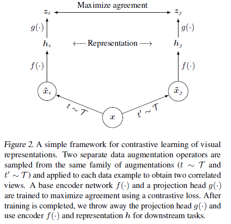
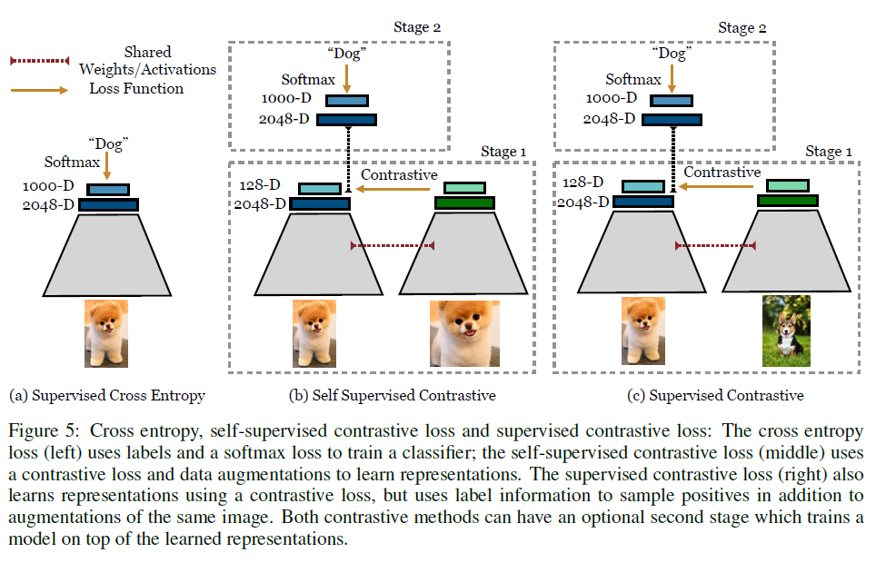
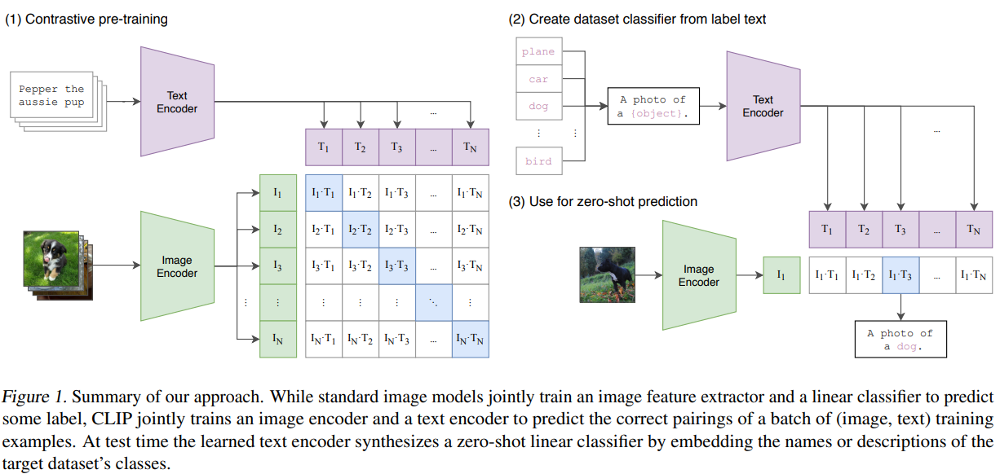
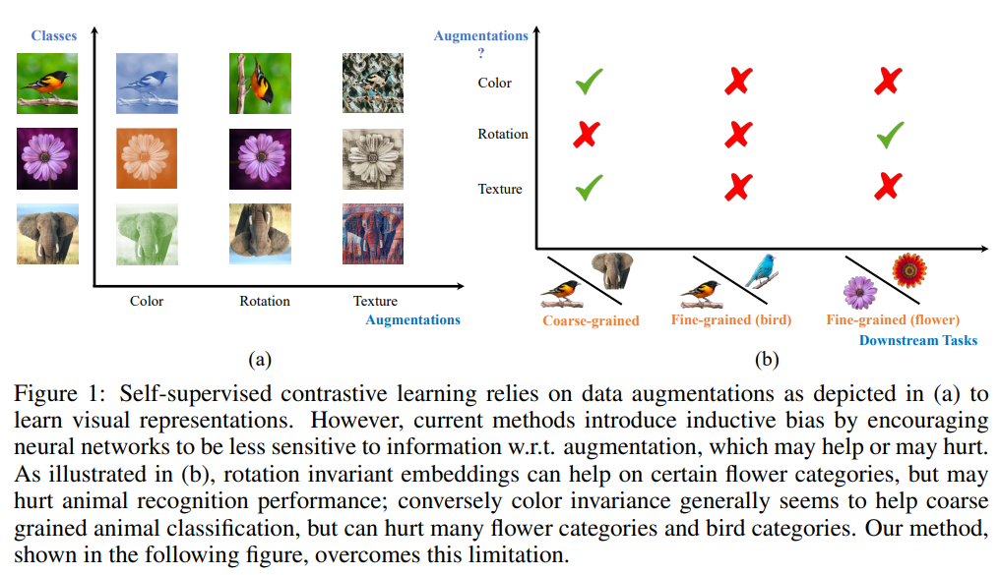
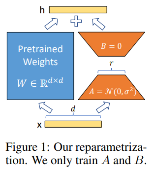

# Learning Notes of Contrastive Learning
- Integrated materials for beginners to understand contrastive learning
- Most of the contents are directly quoted from the linked blogs and papers.

[TOC]

## Contrastive learning and metric learning

In the world of machine learning, there are various techniques to help computers understand and recognize patterns in data. Two such techniques, metric learning and contrastive learning, are popular methods for learning meaningful embeddings or representations of data points.

### [Metric Learning]((https://yanwei-liu.medium.com/understanding-metric-learning-and-contrastive-learning-a-beginners-guide-680115baf3a4))
Metric learning is a method that teaches a computer program to measure the similarity or difference between different data points, like images, text, or sounds. The goal is to learn a distance metric in the embedding space such that similar data points are close to each other, while dissimilar points are farther apart. This technique is often used in tasks like k-Nearest Neighbors classification, clustering, and image retrieval, where distance or similarity between data points is important.

**Example:**
Consider a scenario where you want to teach a program to recognize different types of animals, like cats, dogs, and birds. Using metric learning, you would provide the program with images of these animals and teach it to measure the similarities and differences between them. This understanding allows the program to correctly classify new images of animals it has never seen before.

### Contrastive Learning
Contrastive learning is another technique that helps computer programs recognize and understand data points by comparing one thing to a group of other things. The main idea is to generate representations where similar pairs have similar embeddings, while dissimilar pairs have distinct embeddings. Contrastive learning has recently gained popularity in self-supervised and unsupervised learning, particularly for tasks like representation learning, pretraining for downstream tasks, and learning disentangled representations.

**Example:**
In the same animal recognition scenario, you would provide the program with pairs of images — some containing the same type of animal and others containing different types of animals. The program would then learn to compare the images and understand what makes the same-type pairs similar and the different-type pairs distinct. This way, when it encounters new images of animals, it can recognize the differences and classify them correctly.

### Conclusion
Both metric learning and contrastive learning play crucial roles in machine learning, particularly in representation learning. While they share some similarities in their goals, they differ in their objectives, loss functions, and applications. Metric learning focuses on directly optimizing the embedding space based on the relationships between data points, while contrastive learning emphasizes the differences between similar and dissimilar pairs of data points.

## Related works
### [SimCLR](https://sh-tsang.medium.com/review-simclr-a-simple-framework-for-contrastive-learning-of-visual-representations-5de42ba0bc66)

- A recently proposed contrastive self-supervised learning algorithms is simplified, without requiring specialized architectures or a memory bank.
- Composition of data augmentations plays a crucial role.
- A learnable nonlinear transformation between the representation and the contrastive loss substantially improves the representation quality.
- Contrastive learning benefits from larger batch sizes and more training steps.
- This is a paper from Prof. Hinton’s Group.

### [Supervised contrastive learning](https://sh-tsang.medium.com/brief-review-supervised-contrastive-learning-d25c6d2065c2)

- The cross entropy loss (left): uses labels and a softmax loss to train a classifier;
- The self-supervised contrastive loss (middle): uses a contrastive loss and data augmentations to learn representations, such as SimCLR;
- The proposed supervised contrastive loss (right): also learns representations using a contrastive loss, but uses label information to sample positives in addition to augmentations of the same image.
- Understanding the connection between training objective and transfer performance is left to future work.

> This proposed loss contrasts the set of all samples from the same class as positives against the negatives from the remainder of the batch, using the labels.

### [CLIP](https://anirbansen2709.medium.com/beginners-guide-to-one-of-the-best-vision-model-clip-contrastive-learning-image-pre-training-46edf55e11c1)

- Contrastive Language-Image Pre-training (CLIP for short) is a open-source, multi-modal (text and images), zero-shot state-of-the-art model introduced by OpenAI in February 2021.
- This model performs simple pre-training of predicting which caption goes with which image and vice versa (hence contrastive) on a huge dataset of 400 million (image, text) [ImageNet has 1.2 million training dataset] pairs collected from the internet in an efficient and scalable way is able to perform really well even Zero-shot on various tasks like text classification.
- Given a batch of N (image, text) pairs, CLIP is trained to predict which of the N * N possible (image, text) pairings across a batch actually occurred. To do this, CLIP learns a multi-modal embedding space by jointly training an image encoder and text encoder to maximize the cosine similarity of the image and text embeddings of the N real pairs in the batch while minimizing the cosine similarity of the embeddings of the N^2 — N incorrect pairings. They optimize a symmetric cross entropy loss over these similarity scores.
- Cosine similarity and pairwise similarity are adopted to evaluate similarity.

## Loss

### [Contrastive loss](https://lilianweng.github.io/posts/2021-05-31-contrastive/)
Contrastive loss is one of the earliest training objectives used for deep metric learning in a contrastive fashion.

Given a list of input samples ${x_i}$, each has a corresponding label $y_i \in {1,...,L}$ among $L$ classes. We would like to learn a function $f_{\theta}(.):\chi \to \Bbb R^d$ that encodes $x_i$ into an embedding vector such that examples from the same class have similar embeddings and samples from different classes have very different ones. 

Thus, contrastive loss takes a pair of inputs $(x_i, x_j)$ and minimizes the embedding distance when they are from the same class but maximizes the distance otherwise.
$$
L_{cl}(x_i,x_j,\theta)=\Bbb L[y_i=y_j]||f_{\theta}(x_i)-f_{\theta}(x_j)||_2^2+ \Bbb L[y_i\neq y_j]max(0, \epsilon - ||f_{\theta}(x_i)-f_{\theta}(x_j)||_2)^2
$$
where $\epsilon$ is a hyperparameter, defining the lower bound distance between samples of different classes.

### NCE
Noise Contrastive Estimation, is a method for estimating parameters of a statistical model. The idea is to run logistic regression to tell apart the target data from noise.

Let $x$ be the target sample $P(x|C=1;\theta)=p_{\theta}(x)$ and $\hat x$ be the noise sample $P(\hat x|C=0)=q_{\theta}(\hat x)$. Note that the logistic regression models the logit (i.e. log-odds) and in this case we would like to model the logit of a sample $u$ from the target data distribution instead of the noise distribution:
$$
log\_odds:\ l_{\theta}(u)=log \frac {p_{\theta}(u)} {q(u)}=logp_{\theta}(u)-logq(u)\ \in （-\infty, +\infty)
$$
After converting logits into probabilities with sigmoid $\sigma(.)$, we can apply cross entropy loss:
$$
L_{NCE}=-\frac{1}{N}\sum_{i-1}^N[log\sigma(l_{\theta}(x_i))+log(1-\sigma(l_{\theta}(\hat x_i)))] \\
where\ \sigma(l)=\frac {1}{1+exp(-l)}=\frac {p_{\theta}}{p_{\theta}+q}\ \in (0, 1)
$$
In many follow-up works, contrastive loss incorporating multiple negative samples is also broadly referred to as NCE.

### InfoNCE
The InfoNCE loss uses categorical cross-entropy loss to identify the positive sample amongst a set of unrelated noise samples.

Given a context vector $c$, the positive sample should be drawn from the conditional distribution $p(x|c)$, while $N-1$ negative samples are drawn from the proposal distribution $p(x)$, independent from the context $c$.

The InfoNCE loss optimizes the negative log probability of classifying the positive sample correctly:
$$
L_{InfoNCE}=-\Bbb E[log \frac {f(x,c)}{\sum_{x'\in X} f(x',c)}]
$$

## Others
### [When NOT CLR](https://chingisoinar.medium.com/self-supervised-learning-what-should-not-be-contrastive-in-contrastive-learning-937814576cef)
You will find this work to be very insightful if you study Contrastive Learning. Unlike previous works in un-/self-supervised learning that propose learning augmentation invariant representations, the authors stress the importance of preserving some style information (e.g., distinguishing red vs. yellow cars). 

They demonstrate that the style-variant framework outperforms some SOTA methods that learn invariant representations by a decent margin. For example:
> Adding rotation may help with view-independent aerial image recognition, but significantly downgrade the capacity of a network to solve tasks such as detecting which way is up in a photograph for a display application.

### [Key tips](https://lilianweng.github.io/posts/2021-05-31-contrastive/#key-ingredients)
**Heavy Data Augmentation**
- Given a training sample, data augmentation techniques are needed for creating noise versions of itself to feed into the loss as positive samples. 
- Proper data augmentation setup is critical for learning good and generalizable embedding features. 
- It introduces the non-essential variations into examples without modifying semantic meanings and thus encourages the model to learn the essential part of the representation. 
- For example, experiments in SimCLR showed that the composition of random cropping and random color distortion is crucial for good performance on learning visual representation of images.

**Large Batch Size**
- Using a large batch size during training is another key ingredient in the success of many contrastive learning methods (e.g. SimCLR, CLIP), especially when it relies on in-batch negatives. 
- Only when the batch size is big enough, the loss function can cover a diverse enough collection of negative samples, challenging enough for the model to learn meaningful representation to distinguish different examples.

**Hard Negative Mining**
- Hard negative samples should have different labels from the anchor sample, but have embedding features very close to the anchor embedding. With access to ground truth labels in supervised datasets, it is easy to identify task-specific hard negatives. For example when learning sentence embedding, we can treat sentence pairs labelled as “contradiction” in NLI datasets as hard negative pairs.
- However, it becomes tricky to do hard negative mining when we want to remain unsupervised. Increasing training batch size or memory bank size implicitly introduces more hard negative samples, but it leads to a heavy burden of large memory usage as a side effect.

### LoRA
- A novel technique introduced by Microsoft researchers to deal with the problem of fine-tuning large-language models. 
- LoRA proposes to freeze pre-trained model weights and inject trainable layers (rank-decomposition matrices) in each transformer block.
- The essence of LoRA is that we can freeze the $W$ and just update $W_a$ and $W_b$, $W_a * W_b$ will give you the updated $\Delta W$. After finetuning, we can update the W with the new $\Delta W$.
- QLoRA is basically LoRA over a quantized LLM i.e. LLM loaded using a lower precision datatype in the memory.

**[what is catastrophic forgetting](https://medium.com/data-science-in-your-pocket/lora-for-fine-tuning-llms-explained-with-codes-and-example-62a7ac5a3578)**
Catastrophic forgetting, in simple terms, is when a machine learning model, like a neural network or artificial intelligence system, forgets how to perform a task it previously learned when it’s trained on new, different tasks especially Fine-Tuning over a pretrained model.

**How does LoRA avoid catastrophic forgetting?**
As we are not updating the pretrained weights, the model never forgets what it has already learned. While in general Fine-Tuning, we are updating the actual weights hence there are chances of catastrophic forgetting.

## Papers and blogs
- [SimCLR](https://arxiv.org/abs/2002.05709) and [Introduction](https://sh-tsang.medium.com/review-simclr-a-simple-framework-for-contrastive-learning-of-visual-representations-5de42ba0bc66)
- [Supervised Contrastive Learning](https://arxiv.org/abs/2004.11362)
- [CLIP](https://arxiv.org/abs/2103.00020) and [Introduction](https://chingisoinar.medium.com/self-supervised-learning-what-should-not-be-contrastive-in-contrastive-learning-937814576cef)
- [LEAVE-ONE-OUT CONTRASTIVE LEARNING](https://openreview.net/pdf?id=CZ8Y3NzuVzO) and [Introduction](https://chingisoinar.medium.com/self-supervised-learning-what-should-not-be-contrastive-in-contrastive-learning-937814576cef)
- [LoRA](https://arxiv.org/pdf/2106.09685.pdf)
- [Lil'Log](https://lilianweng.github.io/posts/2021-05-31-contrastive/)
- [Contrastive Loss](http://yann.lecun.com/exdb/publis/pdf/chopra-05.pdf)
- [NCE](https://proceedings.mlr.press/v9/gutmann10a/gutmann10a.pdf)
- [InfoNCE](https://arxiv.org/abs/1807.03748)
- [Metric learning](https://yanwei-liu.medium.com/understanding-metric-learning-and-contrastive-learning-a-beginners-guide-680115baf3a4)

