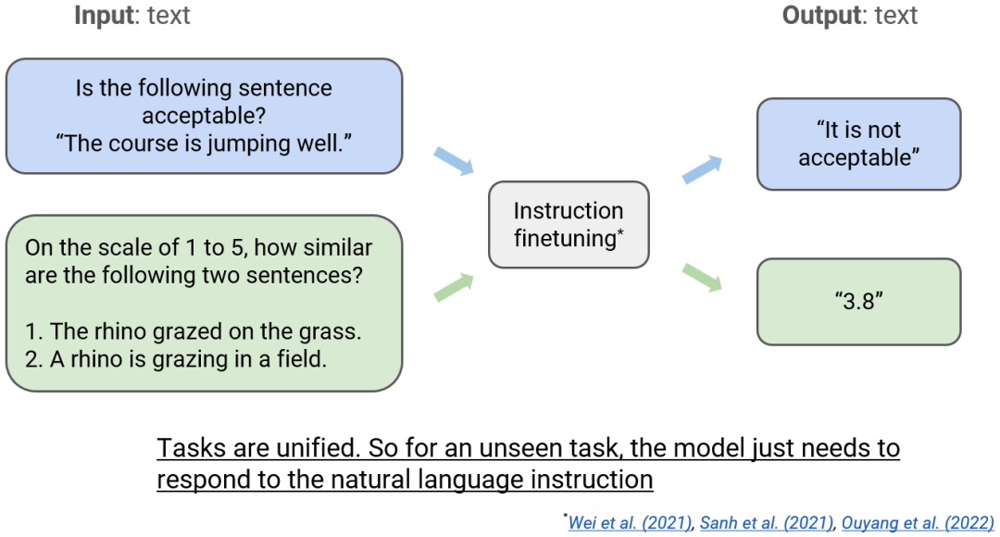

https://mp.weixin.qq.com/s/Kwkn7H82QV7KaFma0r7SlQ
https://www.youtube.com/watch?v=dbo3kNKPaUA

- Bert: 通过下游模型完成分类等任务
- T5: 通过元数据，提示模型完成何种任务，例如cola/stsb等任务
    
    - T5的做法不自然，不符合人类的表达习惯。接下来的发展就是让模型能够理解以自然语言表达的任务。比如现在我们不再使用 cola 来指示模型执行 GLUE 中的 CoLA 任务，而是问：「下面的句子是否是可接受的？」
- PaLM等, instruction learning, 在问题前面给出提示句，提示模型是何种任务
    
    - 为什么 T5 模型诞生的时候没有采用这种方法呢？当时人们认为语言模型不能理解自然语言指令，反而觉得使用元数据的方式更自然。当更大的模型出现后，理解自然语言的能力就涌现出来了，然后我们就能使用丰富的自然语言将各种任务统一起来。之后，当模型遇到未曾见过的任务时，模型只需响应自然语言指令即可。这也是一种泛化。
- 这就引出了一个问题：如果训练集中有更多指令，能不能得到更好的模型，实现更好的泛化呢？
    - 随着模型增大以及训练任务增多，模型的表现越来越好；但任务数量增至一定程度时，模型的性能增幅也会降低。
    - 原因：指令微调的学习目标，不管是使用交叉熵损失还是最大似然，目标都是对于给定输入都能给出单个正确回答，而其它答案都是错的。在强化学习文献中，这被称为行为克隆（behavior cloning）。
    - 我们希望如果能有足够多的这些答案的变体，模型就能泛化用于不同的任务类型 ---> RLHF
- RLHF
    - 强化学习（RL）提供了一种学习目标函数的方法。
    - 强化学习的目标是最大化预期的奖励函数，而我们可以使用一个神经网络模型（奖励模型）来为更为复杂的情况制定奖励。
    - RLHF 的一个常见问题是「奖励攻击（reward hacking）」:
        - 举个例子，假设有人类标注者对一些完成结果进行标注 —— 标记一对结果中哪一个更好，而如果他们标记的都刚好是更长的结果更好，那么策略模型就会认为奖励模型更喜欢更长的结果，然后渐渐地，它就会越来越多地给出很长但看起来很蠢的结果。这时候奖励模型给出的奖励越来越高，但人类的满意度却会下降。这种现象其实很难控制，还没有彻底解决这一问题的方法。

