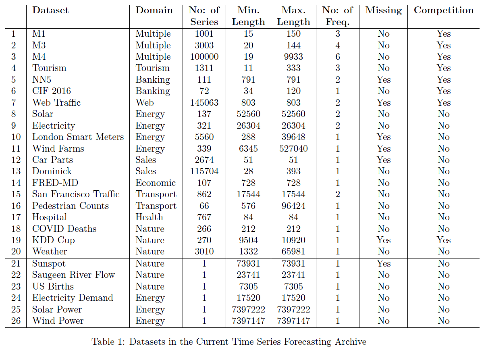
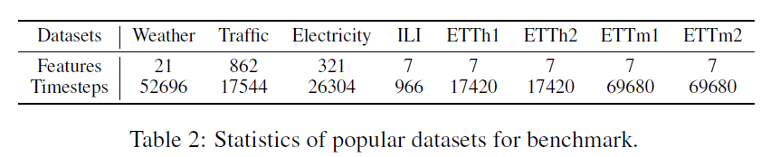

[TOC]

# Long-term time-series forecasting (LTFS)

- Given historical data, forecasting data in the future.
- long-standing task.

## [Application](https://doi.org/10.1155/2022/6596397)
- traffic and environment
    - traffic flow
    - environment pollution
    - river flow
    - streamflow
- energy management
    - electricity demand
    - power load forecasting
    - solar power
- financial investment
    - energy cost building
    - forex price
    - gold price
    - stock price
    - stock exchange
- healthcare prediction
    - heart rate
    - COVID-19 prediction
    - forecasting pandemic
    - Influenza outbreak forecasting
    - Parkinson's disease diagnosis
- weather forecasting
    - climate forecasting
    - wind speed
    - rain fall
    - wind power forecasting

## [Problem Formulation](https://github.com/cure-lab/LTSFLinear)
> For time series containing $C$ variates (univariate/multivariate), given historical data $\chi=\{X^t_1,...,X^t_C\}^L_{t=1}$, wherein $L$ is the **look-back window size** and $X^t_i$ is the value of the $i_{th}$ variate at $t_{th}$ the time step. The time series forecasting task is to predict the values $\hat \chi=\{X^t_1,...,X^t_C\}^{L+T}_{t=L+1}$ at the **$T$ future time steps**.
> when $T>1$,
> - **IMS**: iterated multi-step forecasting, learns a single-step forecaster and iteratively applies it to obtain multi-step predictions. IMS predictions have smaller variance thanks to the autoregressive estimation procedure, but they inevitably suffer from error accumulation effects. Consequently, IMS forecasting is preferable when there is a highly-accurate single-step forecaster, and $T$ is relatively small.
> - **DMS**: direct multi-step forecasting, directly optimizes the multi-step forecasting objective at once. In contrast, DMS forecasting generates more accurate predictions when it is hard to obtain an unbiased single-step forecasting model, or $T$ is large.

## [Data](https://forecastingdata.org/)
> - So far, **little progress** has been made to exploit pre-trained or foundation models for time series analysis. 
> - **One main challenge** is the lack of the large amount of data to train a foundation model for time series analysis. 
> - The largest data sets for time series analysis is less than **10GB**, which is much smaller than that for NLP.

==Common setting:==
- look back window: $L\in \{24, 48, 96, 192, 336, 720\}$
- long time forecasting: $T\in \{24, 36, 48, 60\}$ for ILI dataset and $T\in \{96, 192, 336, 720\}$ for other datasets

==whole data: (large datasets: Weather, Traffic, and Electricity)==

==popular dataset for benchmark==

## Method
目前该领域都是小模型，单卡训练的百M内的模型，主要瓶颈即数据量
### [classical](https://ieeexplore.ieee.org/document/8742529/)
- Auto Regressive Integrated Moving Average(ARIMA)
- GBRT, gradient boosting-greedy function approximation
- filtering-based mothod
- SVM
- GP, time-consuming
- HMM, time-consuming
- clusting-based

### [deep learning](https://github.com/qingsongedu/time-series-transformers-review)
近几年主流 to 2023:
- **CNN-based**: LogTrans, TimesNet
- **MLP-based**: DLinear, LightTS
- **Fourier/auto-correlation machanism**: FEDformer, Autoformer
- **Transformer-based**: PatchTST, Stationary, Informer, Pyraformer

|Time|Publish|Paper|Describe|
|-|-|-|-|
|2023|NIPs|**One Fits All** GPT4TS |GPT pretrained on NLP/CV and finetuned on time-series sequence, only six layers, transfer learning|
|2023|ICLR| TimesNet| treated time series as a 2D signal and utilized a convolution-based inception net backbone to function as a comprehensive time series analysis model, provide benchmark lib, 3k+ stars| 
| 2023| ICLR|  **PatchTST**| divide a sequence into patches to increase input length and reduce information redundancy, with channel independent. ==和waveformer基本一致的预处理==| 
| 2023| ICLR|  DLinear| a simple MLP-based model and validates channel-independence works well in time series forecasting.| 
| 2022| ICML| ==FEDformer==| uses Fourier enhanced structure to improve computational efficiency and achieves linear complexity| 
| 2022| NIPs|  None-Stationary|  propose Non-stationary Transformers as a generic framework with two interdependent modules: Series Stationarization and De-stationary Attention.| 
| 2022| ICLR Rejected | ETSformer| propose two novel attention mechanisms – the exponential smoothing attention and frequency attention| 
| 2022| / | LightTS| a light deep learning architecture merely based on simple MLP-based structures| 
| 2021|  AAAI best paper| Informer| provide a benchmark dataset ETT, propose ProbSparse self-attention mechanism and generative style decoder, can predicts the long time-series sequences at one forward operation| 
| 2021|  NIPs| ==Autoformer==|  replaces the attention module with an Auto-Correlation mechanism.| 
| 2021| ICLR|  ==Pyraformer==|  applies pyramidal attention module with inter-scale and intra-scale connections which also get a linear complexity.| 
| 2020|  ICLR|  Reformer|  improve the efficiency of Transformers, replace dot-product attention by one that uses locality-sensitive hashing and use reversible residual layers instead of the standard residuals| 
| 2019| NIPs|  LogTrans|  uses convolutional self-attention layers with LogSparse design to capture local information and reduce the space complexity| 
| | | LSTMa| | 
| | | DeepAR| | 
| | | Prophet| | 

- NIPs注重理论/公式分析
- ICLR的可视化/实验分析居多

## Update 2024

- TimeMixer，ICLR 2024
    - 3+8+5 to 6，accept poster
    - Down-sampling，Multiscale Time Series，纯mlp，小模型
- iTransformer，ICLR 2024
    - vanilla transformer with channel mixing in self-attention
    - Variate-based Embedding
- TMDM, ICLR 2024
    - 另一个赛道，取巧，文章没有提也没和其他transformer based比较结果，运气好，审稿人也不了解ts，审稿意见少；diffusion based model公式多，占优势
    - Diffusion based model, 只是做到了diffusion系列的sota，MSE和MAE比其他transformer差很多
    - 引入了两个evaluation metric：QICE，CRPS，评估分布的不确定性，由于transformer based模型不存在该项误差，所以论文理所应当的在对比MSE和MAE时没有和MSE-SOTA的模型比较，取巧
- InjectTST，中国移动研究院
    - non-overlap patch
    - channel independent backbone
    - channel mixer: cross attention (KV)
    - 其他文章如：MCformer，highlight也是在如何设计channel mixer
- LLaTA, 清华深研院
    - 引入文本数据
    - 通过文本和时序数据的模态对齐，优化现有的GPT4TS，cross-modality knowledge distillation
    - 另一篇引入文本的文章Time-LLM，在input前面增加prefix embedding token，生成patch embedding时把ts当做Q，把prompt作为KV，输出cross-attention作为data embedding token
    - UniTS，Unified model，可输入文本，ts等，可做不同的任务，imputation、generation、classification，主要模块是cross attention，attention与patchtst类似，FFN引入conv，其他方法上创新少，主要是unified model的概念
- Caformer
    - 任务和UniTS一致，long-term and short-term forecasting，imputation，classification，anomaly detection
    - 偏向基于domain knowledge的feature extraction model design，手动设计cross dimension dependency
- ConvTimeNet
    - overlapped patch window
    - full conv net， depth wise and point wise
- TimeMachine, D-Mamba
    - SSM替代self-attention
    - handling of channel-mixing and channel-independence situations with SSM modules
    - unidirectional vanilla S4
- MegaByte, byteGPT
    - 两个decoder，patch decoder+byte decoder
    - 相比于byte tokenizer，可减少FLOPS
    - Megabyte只在nlp上测试，MambaByte也是

- 先找好数据和baseline代码：https://github.com/thuml/Time-Series-Library/tree/main
- ideas
    - figure 1：总结现有方法，以及我们的方法的出发点
    - figure 2：overview of our method
    - other details and results

## Thoughts
### GW template
长时外推，主要的难点是降低累积误差
- 可选的方向
    - 魔改attention module，例如使用auto-correlation，可解释性强
    - 引入类似memory token的机制
    - IMS改为DMS，或介于两者之前
    - axial self attention，性能的微调
- 目前的问题
    - 验证：目前把近似模板当做训练的groundtruth，近似模板生成的不慢，模板GPT的作用在哪里？xxx
    - 训练：直接生成五天的数据，离真实数据复杂度还差很多（离并合还很远）；之前没关注到，需要调整数据生成代码，足够长且带overlap的截
    - 测试：生成一个固定的测试集，覆盖不同参数下从开始到并合结束整个过程的模板；完善长时外推代码，按现在的方式是逐个token外推
- 假模板，proof of concept，验证，1:1外推验证
- 预测结果带入偏微分方程里，验证符合动力学过程（轨道参数会变化，假设与验证，）

### Transfer learning

- 早两年的思路：降低复杂度，针对特定任务的设计特征提取模块；由于数据少，可在模型结构上下功夫；
- 最新的阿里论文：在NLP预训练的模型，在时序数据上transfer learning；但模型依然不大，只有6层，主要原因还是下游任务用来finetune的数据也不多；

> 在GW上预训练大模型，提供一个baseline backbone/checkpoint，强大的backbone，微调后可用于各种time-series forecasting任务，证明：
> - 亮点1：同类型同模态的数据 拥有更相近的内在信息特征 跨领域信息， GW有丰富的长时相关性以及non-stationary特性
> - 亮点2：提供了一个dataset for time-series forecasting benchmarking
> - 亮点3：结果SOTA
> - ablation study: 不同的architecture，如BN比LN好；不同的模型规模；不同的数据长度；不同下游任务模型间的transfer
> - discussion: 深入分析为什么这个pretrained model更好，数据依赖？一定程度对非稳态信息学习得更好？参考one fits all与PCA的对比分析，timesnet/patchTST feature visualization分析

只有一个通道的GW数据相当于只有一个variate，刚好和channel independent的方式匹配

----------

[**ETT (Electricity Transformer Temperature)**](https://paperswithcode.com/dataset/ett)
Introduced by Zhou et al. in Informer: Beyond Efficient Transformer for Long Sequence Time-Series Forecasting
The Electricity Transformer Temperature (ETT) is a crucial indicator in the electric power long-term deployment. This dataset consists of 2 years data from two separated counties in China. To explore the granularity on the Long sequence time-series forecasting (LSTF) problem, different subsets are created, {ETTh1, ETTh2} for 1-hour-level and ETTm1 for 15-minutes-level. Each data point consists of the target value ”oil temperature” and 6 power load features. The train/val/test is 12/4/4 months.
https://paperswithcode.com/sota/time-series-forecasting-on-etth2-48?p=informer-beyond-efficient-transformer-for

what is linear probing

