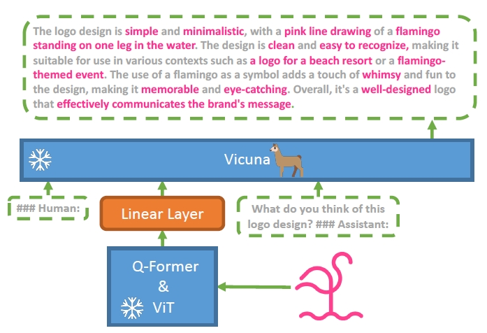
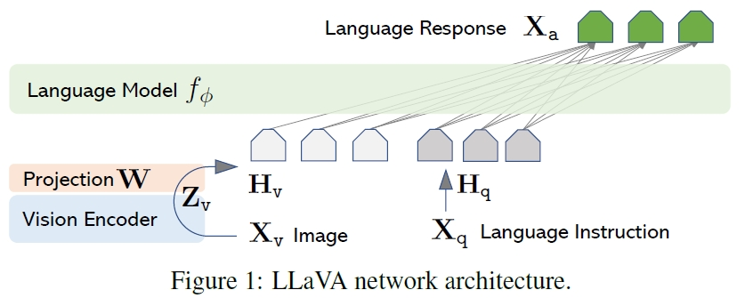

https://zhuanlan.zhihu.com/p/639664615
arxiv:2306.13549v1 A Survey on Multimodal Large Language Models

# Multimodal instruction tuning

## job description
多模态指令样本通常包括指令和输入输出对。指令通常是描述任务的自然语言句子，例如“详细描述图像”。输入可以是像视觉问答（VQA）任务那样的图像-文本对，也可以是像图像字幕任务那样的仅图像。输出是以输入为条件的指令的答案。

## 模态对齐 Modality Alignment
自动语音识别（ASR）
对齐预训练的一种常见方法是保持预训练模块（例如视觉编码器和LLM）冻结，并训练一个可学习的接口。

## 模态桥接 Modality Bridging
由于LLM只能感知文本，因此有必要弥合自然语言和其他模态之间的差距。然而，以端到端的方式训练大型多模态模型将是昂贵的。

此外，这样做会带来灾难性遗忘的风险。因此，一种更实用的方法是在预训练的视觉编码器和LLM之间引入可学习的接口（learnable interface）。另一种方法是在专家模型（expert model）的帮助下将图像翻译成语言，然后将语言发送给LLM。

### learnable interface
当冻结预训练的模型的参数时，可学习接口负责连接不同的模态。挑战在于如何有效地将视觉内容翻译成LLM能够理解的文本。
- 一个常见且可行的解决方案是利用一组可学习的查询 Token以基于查询的方式提取信息，这首先在Flamingo和BLIP-2中实现，随后被各种工作继承。
- 此外，一些方法使用基于投影的界面来缩小模态间隙。例如，LLavA采用简单的线性层来嵌入图像特征，MedVInTTE使用两层多层感知器作为桥接器。
- 还有一些工作探索了一种参数有效的调整方式。LLaMA适配器在训练期间在Transformer中引入了一个轻量级适配器模块。LaVIN设计了一种 Hybrid 模态适配器来动态决定多模态嵌入的权重。

### expert model
除了可学习的界面外，使用专家模型，如图像字幕模型，也是弥合模态差距的可行方法。不同的是，专家模型背后的想法是在没有训练的情况下将多模态输入转换为语言。这样，LLM就可以通过转换后的语言间接地理解多模态。

例如，VideoChat Text使用预训练的视觉模型来提取动作等视觉信息，并使用语音识别模型丰富描述。尽管使用专家模型很简单，但它可能不如采用可学习的界面那么灵活。将外来模态转换为文本通常会造成信息丢失。正如VideoChat文本所指出的，将视频转换为文本描述会扭曲时空关系。

## Multimodal In-context learning
ICL是LLM的重要涌现能力之一。ICL有两个很好的特点：

- 与传统的从丰富的数据中学习内隐模态的监督学习范式不同，ICL的关键是从类比中学习。具体而言，在ICL设置中，LLM从几个例子和可选指令中学习，并推断出新的问题，从而以少量的方式解决复杂和看不见的任务。
- ICL通常以无训练的方式实现，因此可以在推理阶段灵活地集成到不同的框架中。与ICL密切相关的一项技术是指令调整，经验表明它可以增强ICL的能力。

在MLLM的背景下，ICL已扩展到更多模态，从而产生了多模态ICL（M-ICL）。在推理时，可以通过向原始样本添加一个演示集，即一组上下文中的样本来实现M-ICL。

在这种情况下，可以对模板进行扩展，如表3所示。请注意，此处列出了两个上下文中的示例进行说明，但示例的数量和顺序可以灵活调整。事实上，模型通常对演示的安排很敏感。

## Multimodal chain of thought
CoT的主要思想是促使LLM不仅输出最终答案，而且输出导致答案的推理过程，类似于人类的认知过程。

## 挑战和未来的发展方向
- 目前的MLLM在感知能力方面仍然有限，导致视觉信息获取不完整或错误。这可能是由于信息容量和计算负担之间的折衷。更具体地说，Q-Former只使用32个可学习的 Token来表示图像，这可能会导致信息丢失。尽管如此，扩大 Token大小将不可避免地给LLM带来更大的计算负担，LLM的输入长度通常是有限的。一种潜在的方法是引入像SAM这样的大型视觉基础模型，以更有效地压缩视觉信息。
- MLLM的推理链可能很脆弱。例如，傅等人发现，在数学计算的情况下，尽管MLLM计算出了正确的结果，但由于推理的失败，它仍然给出了错误的答案。这表明单模态LLM的推理能力可能不等于LLM在接收到视觉信息后的推理能力。改进多模态推理的主题值得研究。
- MLLM的指令跟随能力需要升级。在M-IT之后，尽管有明确的指示，“请回答是或否”，但一些MLLM无法生成预期答案（“是”或“否”）。这表明指令调整可能需要涵盖更多的任务来提高泛化能力。
- object hallucination问题很普遍，这在很大程度上影响了MLLMs的可靠性。这可能归因于对准预训练不足。因此，一个可能的解决方案是在视觉模态和文本模态之间进行更细粒度的对齐。细粒度是指图像的局部特征，可以通过SAM获得，以及相应的局部文本描述。
- 需要参数高效训练。现有的两种模态桥接方式，即可学习接口和专家模型，都是对减少计算负担的初步探索。更有效的训练方法可以在计算资源有限的MLLM中释放更多的功率。

# Review

- 2021 DeepMind，Frozen LM
    - 先将图片编码成visual tokens，然后作为prefix跟文本的tokens一起输入到LLMs。
    - 仅有vision encoder是支持训练，而LLMs参数处于冻结状态，训练成本大大降低，有了chatgpt系列的技术之后，这一思路被用到多模态大模型上。
        

- 2022 DeepMind，Flamingo, 基于Frozen LM的改进
    - 使用更大的LLMs，80B max vs 7.4B
    - 引入perceiver resampler和XAttn-Dense两个适配单元作为可训练的模块
        - perceiver resampler：基于Perceiver/DETR backbone，通过设计多个Perceiver Resampler来生成64个固定长度的tokens，主要作用在于可以从图像中提取固定长度的特征向量，能够解决图像甚至多帧视频的feature map不一致的问题。
        - XAttn-Dense：在每一层LLM上都会增加corss- attention以入到LLM中与视觉向量进行交互，融合多模态信息。
        

- 2022 Allen AI，ScienceQA，[420 stars](https://github.com/lupantech/ScienceQA)，主要针对QA任务，提供了ScienceQA dataset

- 2023 Salesforce，BLIP-2 & InstructBLIP，[LAVIS，7k stars](https://github.com/salesforce/LAVIS/tree/main)
    - total 3~12B，trainable ~100M
    - BLIP结合了encoder和decoder，提出了MED（mixture of encoder-decoder）模块，即形成了统一理解和生成（Understanding&Generation）的多模态模型。统一的动机在于encoder模型如CLIP没有生成器无法做VQA等生成任务，而如果用encoder-decoder框架无法做retrieval任务。
    - BLIP-2和Flamingo一样，用一个Qformer来提取图像特征（等同与Flamingo的perceiver resampler），然后用cross- attention进行多模态交互，此时视觉编码器和LLM都会被冻结，只训练Qformer，而在下游任务微调时，可以再解锁视觉编码器，让它跟Qformer一起训练
    - BLIP-2没有使用Flamingo那种图文交错的数据，因此没有太强的in-context learning能力。但InstructBLIP很好的解决了这个问题
    - BLIP-2设计了两阶段的训练策略，以使视觉编码器能学会提取更关键的信息。
        - 第一阶段：使用多种预训练任务，如Image-Text Contrastive Learning，Image-grounded Text Generation，Image-Text Matching让Qformer学会如何从视觉编码器中抽取文本相关的特征。
        - 第二阶段，将Qformer插入到LLMs中，用language modeling进行训练。
        

- ==2023 Microsoft，Kosmos-2，[unilm, total 15.9 stars](https://github.com/microsoft/unilm)==
    - Kosmos2基于kosmos1，额外构建下游任务数据集，可完成perceiving object descriptions (e.g., bounding boxes) and grounding text to the visual world等新任务
    - KOSMOS-1是一个基于decoder-only Transformer的因果语言模型、并且完全从头开始训练，能够instruction following和in-context learning。
        - 对于多模态的输入，会使用特殊符号进行每种模态的分割
        - 使用Flamingo中的Resampler对图像特征编码
        - 使用Magneto的初始化、xPos的position embedding、CLIP（ViT-L/14）得到1024维图新特征
        - total 1.6B参数，~100M trainable
        - 在KOSMOS-1使用instruction tuning后，出现了很多类似的文章，如MiniGPT-4，LLaVA，mPLUG-Owl，InstuctBLIP等
        

- ==2023 Abdullah，MiniGPT-4，[22.8k stars](https://github.com/Vision-CAIR/MiniGPT-4)==
    - 基于BLIP2和Vicuna
    - 将BLIP-2的Qformer和视觉编码器引入，再拼接用户的query（含多轮对话），再输入到Vicuna中生成输出- 大多数参数被冻结，只有视觉端的一个用于映射模态的线性层参与微调
    - total 7~13B，~ trainable 15M。
    - 微调策略跟KOSMOS-1一样采取两阶段思路：
        - 第一阶段：采用CC、SBU、LAION等的图文对作为多模态训练数据集。
        - 第二阶段：利用ChatGPT构建一个多模态高质量的数据集。这里高质量数据主要是利用ChatGPT构造出来的，即先利用第一阶段的captino模型对5k个CC的图片生成多个caption（限制最小长度为80，如果不够就让模型继续描述），然后用ChatGPT进行改写、移除重复等以保证质量和扩展丰富度。最后人工review一遍这个数据集，共得到3.5k图文对进行训练，这一阶段只训练线性映射层。
        

- ==2023 Microsoft，LLAVA，[8.6k stars](https://github.com/haotian-liu/LLaVA)==
    - 和MiniGPT-4类似，但在做完第一阶段的微调后，再更近一步在多模态指令下进行微调。
    - CLIP（ViT-L/14）作为视觉编码器，外加一个线性映射层将视觉特征映射到文本空间,LLaMA作为文本解码器。
    - 额外人工标注了一些数据用于in-context learning。最后得到微调数据集主要包括：多轮对话的QA，图像描述、复杂推理等数据，使得模型能够应对各种各样的用户query。
    - 在训练策略上，也采用两阶段的训练策略，即先训gap，然后训instruction：
        - 第一阶段：在CC3M中筛出595k条图文对（限制caption中名词词组的最小频率），用language model loss对模型进行微调。其中，冻结视觉和语言编码器，只微调线性层；
        - 第二阶段：用GPT-4生成的158k数据进行指令微调，同样用language model loss对模型进行微调。其中，冻结CLIP，微调线性层和LLaMA。。
        

- 2023 Google，PaLM-E，超大模型，562B，未开源，主要关注人机互动以及在robot领域的应用

speech signal

SeamlessM4T：提供ckpt、inference API，无detailed training code

vicuna 16k
gpt4 25k

# Appendix
- VQA: visual question answering
- retrieval任务: 根据检索词查找相关内容
- MLLM在医学领域/语音的应用，仍然是语言/图像理解等自然语言任务，如arXiv:2305.10415，arXiv:2306.00890，归根到底还是LM

- One fits all (FTP): 无标准意义的tokenizer，把每个数据/数据段作为tokenize/projection之后的向量，通过线性/卷积映射到与encoder匹配的维度，具体实现参考patchtst，与我们的waveformer方法类似

- LLaMA tokenizer: BPE tokenizer, a data-driven algorithm, meaning that it learns which byte pairs are most common in the training data and merges those pairs together first.
    > Here is an example of how LLaMA might tokenize the number "1234567890":
    > - First, the number is broken down into its individual bytes: [1, 2, 3, 4, 5, 6, 7, 8, 9, 0]
    > - Next, the BPE algorithm merges the most common byte pairs together. For example, the byte pair 12 is very common in English, so the algorithm would merge these two bytes together to form a new token.
    > - The algorithm would continue merging byte pairs together until it reaches a certain number of tokens, or until it is no longer able to merge any more byte pairs.
    > - The final result might be something like this:
    > [`[1, 2]`, `3`, `[4, 5]`, `6`, `7`, `[8, 9]`, `0`]

- Meta-transformer: 与FTP类似，patchify+conv+flatten
- PromptCast tokenizer：基于FEDformer，nn.linear映射，结合频谱和时序数据
- LLMTIME tokenizer：rescale+逐个digit（pad space）tokenize+CRPS loss

问题：可表述数据的长度有限，
==解决方法，构建一个更大的vocabulary，10x10+1，10x10x10+2,固定两个数字作为一个vocabulary里的一个单词==

专利：
提出了新的tokenizer，有限的vocabulary，实现长序列输入；
tokenizer switcher/adapter，根据loss自适应调整tokenizer，提升性能；
loss switcher，根据模态类别自适应调整loss，可学习的alpha，提升性能和收敛速度；

实现超长时序序列输入
自适应调整tokenizer
自适应调整loss

给出大量可选的loss
提出loss耦合的方法  loss switch + loss coefficient
tokenizer方法 实现长序列输入

一种损失函数自适应优化的时间序列预测方法
多模态

时间序列预测 自适应 0
时间序列预测 损失函数 143

time-series forecasting
loss function
adaptive

欧洲
(txt = "time series" and txt = forecasting) AND (txt = loss and txt = function) 7
(txt = "time series" and txt = forecasting) AND (txt = adaptive) 13

美国
(time-series forecasting) AND (loss function optimization)  24
(time-series forecasting) AND (adaptive optimization)   62

知网
损失函数优化+时间序列预测   3  高级搜索

损失函数自适应优化 时间序列预测  145